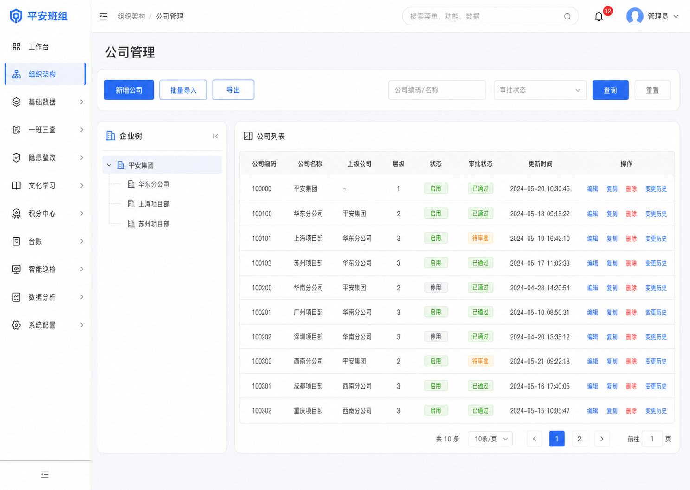
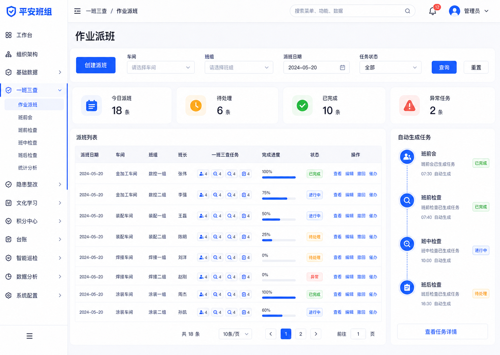
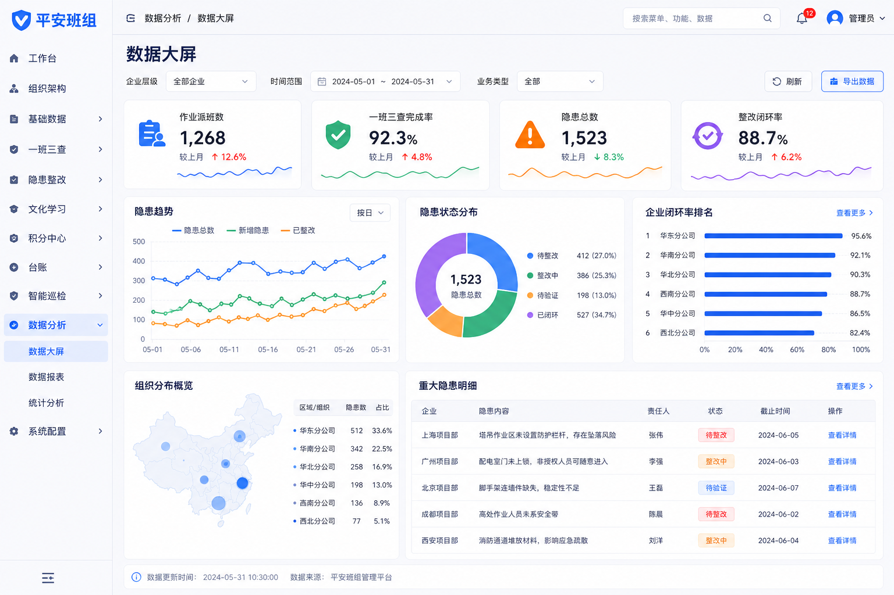

# 平安班组 — AI UI Design Toolkit 端到端实战案例

> 使用 AI UI Design Toolkit 的完整六阶段工作流，为"平安班组"安全生产管理系统产出 PRD、首要页面效果图、UI Spec 和前端实现。

## 项目背景

平安班组面向企业安全生产与班组现场管理场景，覆盖组织架构、一班三查、隐患整改、文化学习、积分激励和数据分析。目标用户包括一线班组成员、安全员、部门经理和企业高管。

## 工作流记录

### Stage 1: 需求与目标

**输入：** 《平安班组功能清单.docx》

**产物：** `01-需求与目标-PRD.md`（423 行 PRD，覆盖 11 个一级模块）

**核心输出：**
- 页面清单与首批首要页面建议
- 各页面 P0/P1/P2 信息优先级
- 15 个数据对象初稿
- 下一阶段视觉探索约束

### Stage 2: 视觉探索

**输入：** Stage 1 PRD

**产物：** 28 张高保真 UI 效果图 + 视觉风格指南

**首批首要页面（6张）：**
| 序号 | 页面 | 代表模块 |
|------|------|----------|
| 01 | 公司管理 | 组织架构 |
| 05 | 作业派班基础数据 | 基础数据 |
| 13 | 一班三查-作业派班 | 一班三查 |
| 18 | 随手拍 | 隐患闭环 |
| 24 | 学习考试中心 | 文化学习 |
| 26 | 数据大屏 | 数据分析 |

**效果图展示：**



*组织架构模块的公司管理页面 — 组织树 + 列表 + 批量操作*



*一班三查模块的作业派班页面 — 派班记录列表 + 派班弹窗*



*数据分析模块的数据大屏页面 — 指标卡片 + 趋势图表*

### Stage 3: UI Spec

**输入：** Stage 2 已批准效果图 + Stage 1 PRD

**产物：** `03-UI规范文档.md`

**涵盖：**
- 已批准视觉方向沉淀
- 11 个模块的信息架构与导航结构
- 每个页面的四状态规则（normal/loading/empty/error）
- 40+ 可复用组件目录
- 工程约束：DRY、src/api、组件嵌套深度

### Stage 4-6: 实现、验证、交付

**产物：** 组件化前端实现 + 截图对比报告 + 交付清单

## 产物清单

```text
平安班组项目/
├── 01-需求与目标-PRD.md                # 需求文档
├── 02-视觉风格与首要页面效果图.md       # 视觉方向 + prompt 包
├── 03-UI规范文档.md                     # UI Spec
├── 04-组件实现说明.md                   # 实现说明
├── 05-截图对比报告.md                   # 验证报告
├── 06-交付清单.md                       # 交付包
└── mockups/
    ├── 01-primary-公司管理.png
    ├── 02-primary-部门管理.png
    ├── ...
    └── 28-primary-智能巡检.png
```

## 关键里程碑

| 阶段 | 耗时 | 人工介入点 |
|------|------|------------|
| PRD 生成 | 1 轮 | 无（基于功能清单自动生成）|
| 首批效果图 | 2 轮 | 确认视觉方向（6 张首要页面）|
| UI Spec | 1 轮 | 无（基于已批准效果图自动生成）|
| 前端实现 | 2-3 轮 | 无（按 Spec 自动生成代码）|
| 截图对比 | 1 轮 | 确认差异清单 |
| 交付归档 | 1 轮 | 确认遗留问题 |

## 复盘要点

- **审批门有效**：首批 6 张效果图让团队在写 Spec 之前就确认了视觉方向，避免了后期返工
- **效果图驱动**：UI Spec 直接从已批准的效果图推导，信息层级和组件定义没有歧义
- **中文工作流**：所有产物为简体中文，产品经理和设计师可直接审阅
